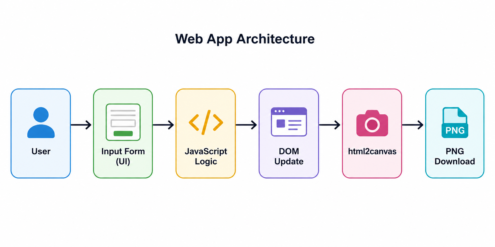
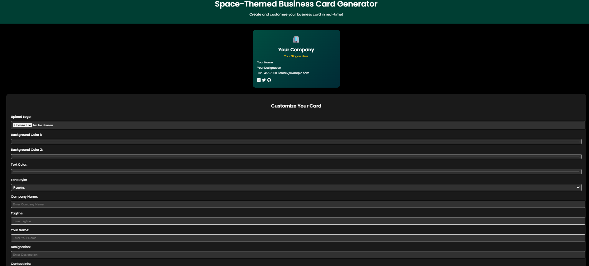
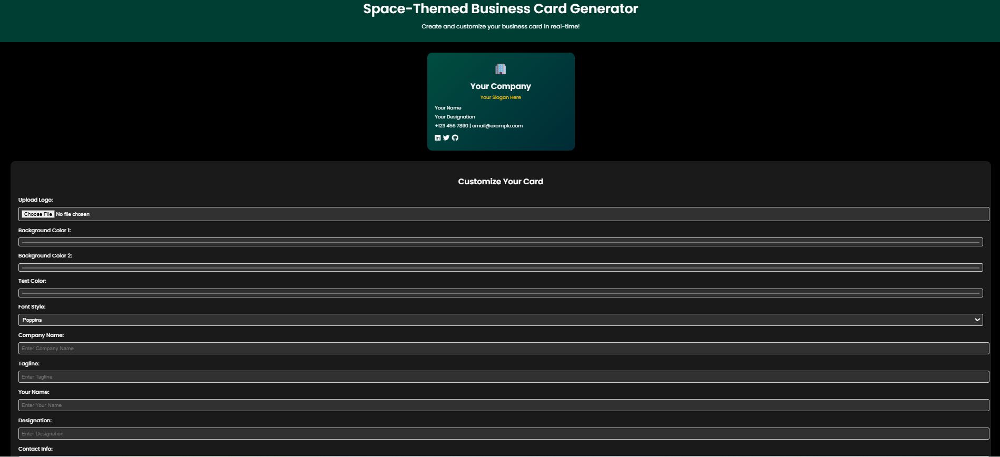

# 🎨 Business Card Generator

## 📌 Overview

A customizable web-based business card generator that allows users to design modern, responsive business cards with real-time preview and export them as PNG images.

---

## 🚀 Features

* Real-time card preview
* Logo upload functionality
* Gradient background customization
* Multiple font styles
* Social media links (LinkedIn, Twitter, GitHub)
* Space-themed animated background
* Fully responsive design
* Export card as PNG using html2canvas

---

## 🛠️ Tech Stack

* Frontend: HTML, CSS, JavaScript
* Libraries: html2canvas, Font Awesome
* Fonts: Google Fonts (Poppins)

---

## 🏗️ Architecture Diagram

### Flow

User → Input Form → JavaScript → DOM Update → html2canvas → PNG Download

---

## ⚡ Performance Metrics

* Page Load Time: 1.2 – 1.5 seconds
* Real-Time Update Delay: <100 ms
* Image Generation Time: ~500 ms
* Responsiveness: Fully responsive (Mobile + Desktop)
* Browser Compatibility: Chrome, Edge, Firefox

---

## 📸 Screenshots

---

## ▶️ Live Demo

https://dograchaitanya20.github.io/Business-Card-Generator/ 

---

## 📥 Installation

1. Clone the repository
   git clone https://github.com/dograchaitanya20/Business-Card-Generator.git

2. Open the folder
   cd Business-Card-Generator

3. Run the project
   Open index.html in your browser

---

## 🧑‍💻 Usage

1. Enter your details
2. Customize colors and fonts
3. Upload your logo
4. Preview updates in real-time
5. Click "Download Card"

---

## 🔮 Future Improvements

* Save designs online
* Add templates
* QR code integration
* Drag-and-drop layout

---

## 🤝 Contributing

1. Fork the repository
2. Create a new branch
3. Commit changes
4. Push to GitHub
5. Create a Pull Request

---

## 📜 License

This project is licensed under the MIT License.

---

## 📬 Contact

Chaitanya Dogra
Aspiring Full Stack Developer
